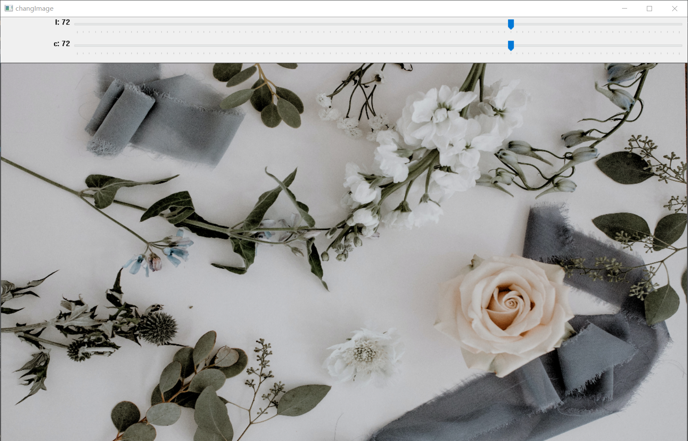

# python numpy opencv调整图片亮度对比度饱和度

原理比较简单，本质上是对图像各个通道的每个像素点做线性变换，对超出范围[0,255]的做截断处理，所以使用numpy处理比较方便

# 安装依赖库

    pip install numpy
    pip install opencv-python

# 亮度变换

    # 修改图像的亮度，brightness取值0～2 <1表示变暗 >1表示变亮
    def change_brightness(img, brightness):
        [averB, averG, averR] = np.array(cv2.mean(img))[:-1] / 3
        k = np.ones((img.shape))
        k[:, :, 0] *= averB
        k[:, :, 1] *= averG
        k[:, :, 2] *= averR
        img = img + (brightness - 1) * k
        img[img > 255] = 255
        img[img < 0] = 0
        return img.astype(np.uint8)

一下函数为了方便展示调用，可自行选择使用

    def cvshow(name, img):
        cv2.namedWindow(name, cv2.WINDOW_NORMAL)
        cv2.resizeWindow(name,1280,720)
        cv2.imshow(name, img)
        cv2.waitKey(0)
        cv2.destroyWindow(name)

对"sc/1.jpg"应用亮度变换

        img = cv2.imread("sc/1.jpg")
        img = change_brightness(img,2)
        cv2.imwrite("sc/2.jpg",img)
        cvshow("change_brightness",img)

应用前

应用后

效果还是比较明显的

# 对比度变换

    # 修改图像的对比度,coefficent>0, <1降低对比度,>1提升对比度 建议0-2
    def change_contrast(img, coefficent):
        imggray = cv2.cvtColor(img, cv2.COLOR_BGR2GRAY)
        m = cv2.mean(img)[0]
        graynew = m + coefficent * (imggray - m)
        img1 = np.zeros(img.shape, np.float32)
        k = np.divide(graynew, imggray, out=np.zeros_like(graynew), where=imggray != 0)
        img1[:, :, 0] = img[:, :, 0] * k
        img1[:, :, 1] = img[:, :, 1] * k
        img1[:, :, 2] = img[:, :, 2] * k
        img1[img1 > 255] = 255
        img1[img1 < 0] = 0
        return img1.astype(np.uint8)

对路径"sc/1.jpg"下图片应用对比度变换实例：

        img = cv2.imread("sc/1.jpg")
        img = change_contrast(img,2)
        cv2.imwrite("sc/2.jpg",img)
        cvshow("change_brightness",img)

应用前

应用后

# 综合调整(完整代码)

为了方便使用，我们创建两个滑块对竖直进行控制，而后按s键进行保存

    import cv2
    import numpy as np
    
    # 修改图像的对比度,coefficent>0, <1降低对比度,>1提升对比度 建议0-2
    def change_contrast(img, coefficent):
        imggray = cv2.cvtColor(img, cv2.COLOR_BGR2GRAY)
        m = cv2.mean(img)[0]
        graynew = m + coefficent * (imggray - m)
        img1 = np.zeros(img.shape, np.float32)
        k = np.divide(graynew, imggray, out=np.zeros_like(graynew), where=imggray != 0)
        img1[:, :, 0] = img[:, :, 0] * k
        img1[:, :, 1] = img[:, :, 1] * k
        img1[:, :, 2] = img[:, :, 2] * k
        img1[img1 > 255] = 255
        img1[img1 < 0] = 0
        return img1.astype(np.uint8)
    
    # 修改图像的亮度，brightness取值0～2 <1表示变暗 >1表示变亮
    def change_brightness(img, brightness):
        [averB, averG, averR] = np.array(cv2.mean(img))[:-1] / 3
        k = np.ones((img.shape))
        k[:, :, 0] *= averB
        k[:, :, 1] *= averG
        k[:, :, 2] *= averR
        img = img + (brightness - 1) * k
        img[img > 255] = 255
        img[img < 0] = 0
        return img.astype(np.uint8)
    
    def cvshow(name, img):
        cv2.namedWindow(name, cv2.WINDOW_NORMAL)
        cv2.resizeWindow(name,1280,720)
        cv2.imshow(name, img)
        cv2.waitKey(0)
        cv2.destroyWindow(name)
    
    def demo():
        # 加载图片 读取彩色图像
        image = cv2.imread('sc/1.jpg',cv2.IMREAD_COLOR)
        l = 50
        c = 50
        MAX_VALUE = 100
        # 调节饱和度和亮度的窗口
        cv2.namedWindow("changImage", cv2.WINDOW_AUTOSIZE)
    
        def nothing(*arg):
            pass
    
        # 滑动块
        cv2.createTrackbar("l", "changImage", l, MAX_VALUE, nothing)
        cv2.createTrackbar("c", "changImage", c, MAX_VALUE, nothing)
        while True:
            # 得到 l、 s 、c的值
            l = cv2.getTrackbarPos('l', "changImage")
            c = cv2.getTrackbarPos('c', "changImage")
            img = np.copy(image.astype(np.float32))
            # 亮度 -1~1
            img = change_brightness(img, float(l - 50) / float(50))
            # 对比度 0~2
            img = change_contrast(img, c / 50)
    
            # 显示调整后的效果
            img = cv2.resize(img, (1280, 720))
            cv2.imshow("changImage", img)
            ch = cv2.waitKey(5)
            # 按 ESC 键退出
            if ch == 27:
                break
            elif ch == ord('s'):
                # 按 s 键保存并退出
                # 保存结果
                cv2.imwrite("result.jpg", img)
                break
    
        # 关闭所有的窗口
        cv2.destroyAllWindows()
    
    
    if __name__ == "__main__":
        demo()

效果

